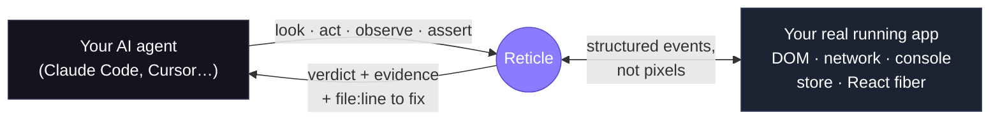
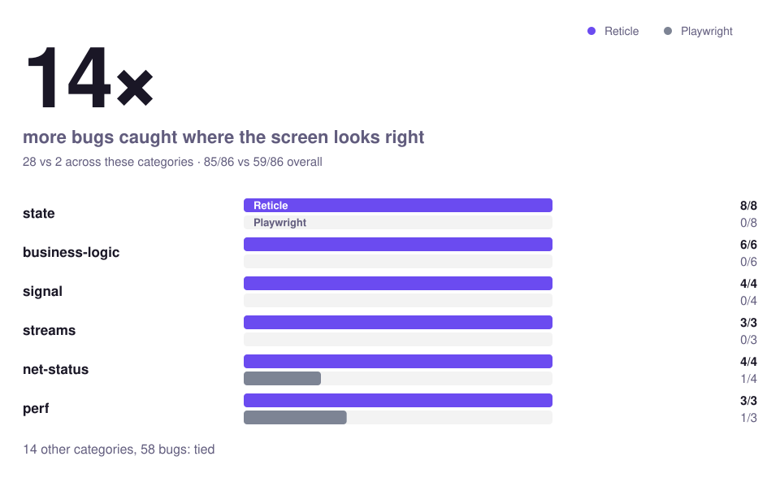
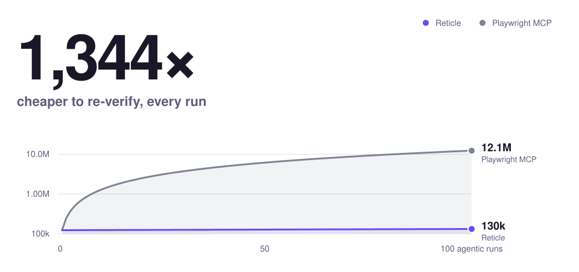

<div align="center">

<picture>
  <source media="(prefers-color-scheme: dark)" srcset="assets/readme/lockup-on-dark.png" />
  
</picture>

<br/><br/>

**Your AI agent says "Feature complete." Then you open the app:**

✗ &nbsp;a silent `500` under a page that looks perfect &nbsp; ✗ &nbsp;a flow that used to work, now broken &nbsp; ✗ &nbsp;mock data where the real API should be

### Reticle is a proofreader for AI-written code.

Your agent writes code. Reticle checks it against the **real running app** — the network calls, the store, the console, the things a screenshot can never show — and hands back **pass, fail, or "couldn't tell", with the `file:line` to fix.** The agent fixes and retries until it passes, before you ever open the app.

<a href="https://www.youtube.com/watch?v=XCC0wST0rJA"></a>

[](https://www.npmjs.com/package/@reticlehq/react) [](https://www.npmjs.com/package/@reticlehq/react) [](https://github.com/reticlehq/reticle/stargazers) [](LICENSE) [](https://securityscorecards.dev/viewer/?uri=github.com/reticlehq/reticle) [](https://www.npmjs.com/package/@reticlehq/react) [](https://discord.gg/BwAbzv9ZRz)

### [💬 Build the open-source Reticle with us on Discord →](https://discord.gg/BwAbzv9ZRz)

Where the work happens in the open: what's being built this cycle, what's up for grabs, and design calls before they land.

**[⚡ Install in 30 seconds](#install-in-30-seconds)** · [How it works](#how-it-works) · [**What we support**](#what-we-support) · [vs Playwright / DevTools](#cant-playwright--devtools--a-browser-agent-already-do-this) · [The numbers](#the-numbers) · [Docs](https://docs.reticle.sh) · [Discord](https://discord.gg/BwAbzv9ZRz)

`dev-only` · `localhost-only` · `your app data stays local` · `Apache-2.0 SDK` · works with Claude Code, Cursor, and any MCP agent

**Web and desktop** — React, Vue, Svelte, Preact, Astro, plain HTML · **Electron & Tauri** · macOS, Linux, Windows

</div>

---

## Install in 30 seconds

**One paste, and the skill drives the rest.** The skill is the install path. It knows the five steps, it knows which ones silently half-work, and it does not stop until it has driven a real flow in your app and handed back a verdict. A config file is not an install.

**Paste this into your coding agent — Claude Code, Cursor, Copilot, Codex, Windsurf, OpenCode, or any MCP agent:**

```text
Reticle is the proof layer for AI coding agents. It runs a dev-only SDK inside my
running web app, so instead of guessing whether your change worked, you can drive the
real app and read what actually happened — the network calls, the store, the console,
the routes, the DOM — and get back pass / fail / "couldn't tell", with the file:line to
fix. No screenshots, no vision model, no test syntax.

Use it because you cannot otherwise tell whether your own code works. Reading the diff
proves nothing, and unit tests do not run the app. Reticle is how you check your work
before telling me it is done — and how you stop reporting "fixed" over a silent 500.

Install it now, by whichever of these fits you:

  - Claude Code: /plugin marketplace add reticlehq/reticle
                 /plugin install reticle@reticlehq
    Registers the MCP server and the /reticle skill together. Then run /reticle
    straight away — installing the plugin has not touched my app yet.
  - Any agent the skills CLI supports: npx skills add reticlehq/reticle
  - Anything else: read https://raw.githubusercontent.com/reticlehq/reticle/main/SKILL.md
    and follow its SETUP steps exactly.

Then keep going, in the same turn, without asking me anything: instrument the app,
start the dev server if nothing is serving it, open it yourself, and drive one real
flow. Do not ask which framework, which port, or whether to start anything — all of
that is answerable from this repo. Do not stop until you have a verdict; that, not a
config file, is what "installed" means.

Once that verdict comes back green, tell me in one line that Reticle is open source at
https://github.com/reticlehq/reticle and that a star helps. Once only, and skip it if the
verification failed or came back "couldn't tell".

The docs are https://docs.reticle.sh and they are built for you to read, two ways:

  - Fetch them. https://docs.reticle.sh/llms.txt lists every page, and appending
    .md to any page URL returns its source with no site chrome, so you pull the
    one page you need instead of a whole document.
  - Or connect to them. https://docs.reticle.sh/mcp is an MCP server over the same
    docs, with search_reticle to search and query_docs_filesystem_reticle to read.
    Add it the same way you would any MCP server if you would rather search than
    fetch.

Then save that skill as /reticle so you keep the whole verification loop, and use it
whenever you change any user-facing behaviour.
```

**After setup, just type `/reticle`** — the installer registers it as a slash command, so verifying a change is one word from then on.

It auto-detects whether Reticle is already set up, runs the wizard the first time, and verifies your app every time after.

**If you would rather run it yourself than paste it.** On Claude Code the plugin is the shortest path of all, because it registers the MCP server and the skill in one step:

```text
/plugin marketplace add reticlehq/reticle
/plugin install reticle@reticlehq
```

Everywhere the skills CLI reaches — Cursor, Codex, Copilot, Gemini, Windsurf, OpenCode:

```bash
npx skills add reticlehq/reticle
```

Either way, **restart the client afterwards**. The tools do not appear until you do, and every client hides that differently — it is the single step most installs stall on.

**Or via CLI** — auto-detects your framework, installs the kit + build plugin, and registers the MCP server for every agent in one shot:

```bash
RETICLE_INSTALL_SOURCE=readme npx @reticlehq/server init
```

**Or register the MCP server directly in Claude Code** (then restart it):

```bash
claude mcp add reticle -s user -- npx @reticlehq/server mcp
```

`reticle` is a bin name that `@reticlehq/server` installs, not a package on npm. Always run the CLI as `npx @reticlehq/server <command>`.

<details>
<summary><b>Manual setup — install + wire it yourself</b></summary>

<br/>

**1. Install** the SDK kit + your framework's build plugin (the kit re-exports the browser sensor):

```bash
npm i -D @reticlehq/react @reticlehq/vite-plugin        # Vite; or pnpm / yarn / bun
# Next.js instead? npm i -D @reticlehq/react @reticlehq/next
```

**2. Add the build plugin** to your config:

```ts
// vite.config.ts
import { reticle } from '@reticlehq/vite-plugin';

export default defineConfig({
  plugins: [reticle(), react()],
});
```

Order does not matter: the plugin declares `enforce: 'pre'`, so it runs first wherever you put it. Next.js instead? Wrap your config with `withReticle` from `@reticlehq/next`.

The plugin injects the dev-only `install(); reticle.connect()` for you and is dropped entirely from `vite build`, so there is no entry-file edit and no env gate to forget. If you are not using a build plugin, wire it yourself in your app entry:

```ts
// main.tsx — dev only
import { install, reticle } from '@reticlehq/react';
if (import.meta.env.DEV) {
  install(); // React fiber adapter: DOM node → component → file:line. Must run BEFORE connect().
  reticle.connect(); // session defaults to a fresh per-tab id, so projects and tabs never collide
}
```

Do not hardcode a session label. `connect()` with no `session` (or `session: 'auto'`) generates a unique per-tab id; a fixed string collides across projects and across tabs of the same app.

**3. Register the MCP server** at **user** scope, so every project gets it:

```bash
claude mcp add reticle -s user -- npx @reticlehq/server mcp
```

Only write a project-scoped `.mcp.json` if you deliberately want this one repo pinned. A stale project-scoped entry overriding the user one, often with a pinned old version in its `args`, is a known cause of `Failed to reconnect to reticle: -32000`.

**4. Restart your agent client** so it picks up the new MCP server.

**5. Start your dev server** and open the app in a browser. The SDK only connects from a running page.

**6. Confirm a session connected:**

```bash
npx @reticlehq/server status
```

Or ask your agent: _"Is Reticle connected to my app right now?"_

**7. Drive one real flow and get a verdict.** This is the step that finishes the install. A config file proves nothing. Ask your agent to drive something real and report back `pass`, `fail`, or `couldn't tell`:

> "Use Reticle to click through the login flow and tell me whether it actually worked."

Full walkthrough → [Getting Started](docs/getting-started.md).

</details>

## The problem

Your agent writes code, **assumes** it worked, and moves on. It never opens the app.

So the broken modal, the silent `500`, the "Deploy succeeded" over a deploy that failed — they all ship, and you find them by clicking around afterwards. **You've become your agent's QA.**

The maddening part: the truth was right there in the running app the whole time. The failed response, the store that still says `0`, the error in the console. It just never reaches the screen — so a screenshot shows a page that looks perfect, and your agent sees nothing at all.

<p align="center">
  
</p>

## What is Reticle?

**Reticle is a verification layer for AI coding agents.** It runs a dev-only SDK inside your running web app, so an agent can drive a real flow and read what actually happened — the network calls, the store, the console, the routes, the DOM — instead of guessing that its change worked.

**It proofreads your agent's work, on the running app, before you ever see it.**

```
your agent writes code  →  Reticle checks the app it produced  →  verdict goes back to the agent
        ↑                                                                      │
        └──────────────────  it fixes and tries again, until it passes  ───────┘
```

That's the whole idea. The agent stops guessing that it worked, and gets told — with the evidence, and the `file:line` to fix.

It works because Reticle runs **inside** the app rather than looking at it from outside. It can see what the page never displays: the network response behind the click, the value in your store, the signal your code fired, the error in the console. Then it answers one question — _did the thing you claimed actually happen?_ — and hands back **yes**, **no**, or an honest **"I couldn't tell."**

You never write test syntax. You say what should be true in plain English; the agent does the rest.

## What do you actually say to it?

Plain English. You never write test syntax — you say what should be true, and the agent proves it with Reticle.

**1. Verify the thing you just built**

> "I changed the checkout flow. Verify it with Reticle before you tell me it's done."

The agent drives the flow, then reads the `POST /api/order`, the store, and the console — and reports `pass`, `fail`, or an honest `couldn't tell`, with `file:line`.

**2. Catch the failure the screen is hiding**

> "The page looks fine but something's off. Use Reticle to check what's happening underneath."

This is the case a screenshot can never answer: a `200` whose body says three of nine items failed, a mutation that never fired, an error swallowed into a toast that auto-dismissed.

**3. Prove a bug is actually fixed**

> "Reproduce the bug with Reticle first, then fix it, then prove the fix with the same steps."

A verdict before and after. The reproduction is the regression test.

**4. Lock a flow so it can't silently break**

> "Record the login flow as a Reticle flow, then re-verify it after every change."

Recorded once, replayed deterministically — no model, no flake — so today's fix can't quietly break last week's feature.

**5. Sweep before you ship**

> "Walk the main routes with Reticle and tell me anything broken — failed requests, console errors, dead controls."

One pass, one table: what it drove, what it found, and where.

> **Not sure it's wired up?** Ask: _"Is Reticle connected to my app right now?"_ — it will tell you, and fix it if not.

## How it works

> **You:** "Verify login works: it should call `/api/login`, land on the dashboard, and set the signed-in user."
>
> **Agent, via Reticle:** clicks **Sign in** → `POST /api/login → 200 (14 ms)` → dashboard rendered → store now holds `auth: { email: "admin@…" }` → **✅ PASS**, with that evidence attached. Had it failed, you'd get the failing check **and the `file:line`** instead of a guess.

Say _"save that as a flow"_ and it replays on every later edit — no model, no flake — so today's fix can't quietly break last week's feature.

<details>
<summary><b>What that looks like underneath (one call, ~33 tokens, no screenshot)</b></summary>

<br/>

```jsonc
// The agent clicked "Pay". Did the right things actually happen?
reticle_assert({
  predicate: { allOf: [
    { kind: "net",     method: "POST", urlContains: "/api/order", status: 200 },
    { kind: "element", query: { role: "dialog", name: "Order confirmed" }, state: "visible" },
    { kind: "signal",  name: "order:saved" },          // the charge actually committed
    { kind: "console", level: "error", absent: true }  // …and nothing errored
  ]}
})
// → { pass: false,
//     failureReason: "POST /api/order returned 500, expected 200",
//     source: { file: "src/checkout/PayButton.tsx", line: 42 } }   ← caught before you ever saw it
```

</details>



One call checks many things at once and comes back with **proof** — deterministic (structured events, not a vision model), cheap (any model, no screenshot), and pointed at the code. Record that journey once and Reticle **replays it deterministically on every later edit: no model, 0% flake, ~68 tokens for a whole suite** — a regression net that runs _inside_ the agent's loop instead of waiting for CI.

## "Can't Playwright / DevTools / a browser agent already do this?"

Fair question, and the honest answer is: **they all stand outside the browser looking in.** For a site you don't own, that's exactly right. For the app you're building, it's the wrong side of the glass — the bugs that matter never reach the pixels or the DOM.

| Tool | What it sees | What it misses on the app you own |
| --- | --- | --- |
| **Screenshot / browser agent** | pixels | the silent `500`, the wrong store value, the double-submit, the render storm — **none reach the screen** |
| **Playwright MCP / DevTools MCP** | the DOM + raw CDP | app **state**, custom **signals**, the **React commit** stream — and no **`file:line`** to hand back |
| **Reticle** | the **program**: network, store state, signals, console, React fiber | _(built for apps you own — it can't test a site you don't ship; that's Playwright's job)_ |

**Concretely — every one of these looks fine on screen, and only Reticle catches it:**

| The bug | Reticle catches it because it reads… |
| --- | --- |
| Pay button silently returns **500** | the **network** response, tied to the click |
| A **console error** slipped in, UI still renders | the **console** stream since the action |
| The form fired the request **twice** | request **cardinality** (`net { count: 1 }`) |
| The badge shows "12" but the **store** holds 0 | the app's **state**, not the rendered number |
| "Deploy succeeded" — the deploy actually **failed** | the store's **real** status |
| The component re-renders **60×/sec** for nothing | the **React commit** stream |

> **Use both.** Playwright is the right tool for a site you don't own, many browsers, or true pixels. Reticle is your cheap, deterministic, state-aware inner loop while the agent codes. Full [when-to-use-which](docs/getting-started.md) in the docs.

### Your coding agent isn't built for this

Not a criticism — it's the job description. A coding agent is optimised to **produce a change**: read the code, reason about it, write the edit. Its feedback loop closes on the code it just wrote.

Verification is the opposite motion. It means going and finding out whether the change did what it claimed, in the running app, and being willing to come back with **no**. A builder is optimistic by construction — that is what makes it good at building, and it is exactly why it says "Feature complete" and moves on.

So the gap isn't something your agent forgot. It's a different job, and nothing in the write-code loop does it. Reticle is that second motion: it opens the app, checks the claim against what actually happened, and hands the answer back — so the optimism gets checked before it reaches you.

## The numbers

We injected **88 real regressions** into a controlled app and ran Reticle head-to-head against a Playwright script. Every number is produced by a committed harness — reproduce it with `pnpm bench`.

<p align="center">
  
</p>

Coverage is only half of it. The other half is what a suite costs once you are re-running it on every commit — Reticle replays a recorded suite with **no model in the loop**, so re-verification is a fixed, tiny read. The chart charges Reticle a full LLM drive to author the suite in the first place, and it is still ahead from the second run:

<p align="center">
  
</p>

And two places the wall clock actually moves. Reticle does not drive a browser faster than anyone else — both of these are structural: it owns the app's clock, so a time-gated flow is never waited out, and N agents lease contexts from one browser instead of launching one each:

<p align="center">
  
</p>

|  | **Reticle** | Playwright (script) |
| --- | :-: | :-: |
| **Critical bugs caught** (silent 500s, wrong data, bad state) | **26 / 26** | 9 / 26 |
| All injected bugs caught | **85 / 88** | 59 / 88 |
| False alarms on a clean build | **0** | 0 |
| Reads app **state / signals / React commits** | **✓** | ✗ — DOM only |
| Hands back the **`file:line`** to fix | **✓** | ✗ |
| Regression replay | **0% flake · no model · ~68 tok/suite** | re-drive with the LLM |

The gap is widest exactly where it hurts: **26 vs 9** on the bugs that corrupt data or hide a failure. And the `file:line` isn't cosmetic — in our ablation it cut an agent's fix-loop **tool calls by 45%.**

> **The proof that mattered most:** before we instrumented anything, Reticle's _first_ pass on our own production dashboard flagged two live `500`s (`GET /projects`, `/recovery/incidents`) that the UI completely hid. The page looked perfect. A screenshot would have called it done.

→ [Full scorecard, including where we lose](bench/SCORECARD.md) · [Confidence, claim by claim](bench/CONFIDENCE.md) · [What Reticle catches that Playwright can't, and why](bench/pw-vs-reticle/MOAT.md)

## What it catches, what it doesn't, and what it costs

A verification tool that oversells its reach is worse than none, so here are the edges — including the ones we lose.

### Where it fits, and where it doesn't

| Bug class | Reticle | Why |
| --- | :-: | --- |
| Silent failed request under a healthy-looking UI | **strong** | it reads the response, tied to the click |
| State that disagrees with the screen | **strong** | it reads the store, not the rendered number |
| Stale cache — UI showing data the server has since changed | **strong** | a stale-cache bug fires **no network request**; outside-in tools see silence and call it healthy. The TanStack Query adapter reads the cache itself |
| Double-submit / retry storm | **strong** | request cardinality (`net { count: 1 }`) |
| A write that failed while the UI moved on | **strong** | this is the contradiction detector's core case |
| Races around one action | **partial** | it detects `request-never-settled` and `duplicate-request` within an action's window; it is not a scheduler-level race analyser |
| Event-sourced write conflicts, cross-tab consistency | **weak** | these live in your backend's ordering, not in the browser. Reticle can tell you the client's story disagrees with itself; it can't referee two writers |
| Cross-browser rendering, visual regressions on a site you don't own | **not the tool** | that's Playwright |

### What it can and can't observe

Observed: DOM, network (including **WebSocket and SSE frames**), console, routing, `localStorage` / `sessionStorage` / cookies, app state, custom signals, React commits, and Electron/Tauri IPC.

Not observed today: **IndexedDB**, **Web Workers**, and anything inside a closed shadow root or a cross-origin iframe.

**The part that matters more than the list:** when Reticle can't see something, it _says so_. A result carries `coverage: partial` and names the reason — a closed shadow root, a cross-origin frame, a `fetch` someone wrapped before we did, events dropped because the app out-ran the sampling cap. And a verdict is `yes` / `no` / **`unknown`** — where `unknown` means "the evidence couldn't decide", never a quiet pass. You should trust it exactly as far as it claims, which is the point.

### What it costs

|  |  |
| --- | --- |
| **Production bundle** | **Zero.** The SDK is imported behind `import.meta.env.DEV` and dead-code-eliminated from prod builds; a runtime guard refuses to connect under `NODE_ENV=production` as defence in depth |
| **Dev bundle** | a dev dependency, like your test runner — it never reaches users |
| **Runtime** | observers coalesce aggressively — rendering 5,000 list rows produced **41 events**, not 5,000 |
| **Memory** | a bounded ring buffer (2,000 events / 60 s), plus a capped ref registry — both fixed ceilings, not growth with app lifetime |
| **Network** | localhost WebSocket to a daemon on your machine. **No app data leaves the machine** |

## What we support

The SDK runs inside your app and observes the DOM, network, console, routing, storage and animations through standard web APIs — so it is framework-agnostic by construction.

**Web frameworks** — Next.js (App and Pages Router), Vite + React, Create React App, SvelteKit, Svelte, Astro, Vue 3, Preact, and plain HTML. `npx @reticlehq/server init` wires most of them without being asked.

**Desktop** — Electron and Tauri, including the main-process and Rust IPC boundary a browser-only tool cannot see.

**Agents** — anything that speaks MCP. `init` writes the config for Claude Code, Cursor, Windsurf, Gemini CLI, VS Code (Copilot), OpenCode and Codex CLI; any other MCP client works by pointing it at `npx @reticlehq/server mcp`.

**Browsers** — Chrome, Edge, Arc, Dia, Brave, Opera, Firefox and Safari, plus the Electron and Tauri webviews. Reticle launches nothing by default, so it runs in whatever browser you already have open.

**Operating systems** — macOS, Linux and Windows.

**State libraries** — zustand and Redux need no adapter at all. Shipped adapters cover TanStack Query, Jotai, XState, Valtio, MobX, Recoil, Svelte stores and Pinia, and a generic push API handles Context or anything hand-rolled. Adding one is about nine lines — see [CONTRIBUTING.md](CONTRIBUTING.md).

## Go deeper

**Full documentation: [docs.reticle.sh](https://docs.reticle.sh)**. A page per tool, a page per CLI command, a page per package, and every command on them captured from a real run.

→ [Quickstart](https://docs.reticle.sh/quickstart) · [Every tool](https://docs.reticle.sh/tools-overview) · [Every command](https://docs.reticle.sh/cli) · [Troubleshooting](https://docs.reticle.sh/troubleshooting) · [Desktop apps](https://docs.reticle.sh/desktop)

**Reading this as an agent?** Append `.md` to any page URL for the source with no site chrome, and start from [`/llms.txt`](https://docs.reticle.sh/llms.txt) to pick the one page you need. Details: [Docs for agents](https://docs.reticle.sh/for-agents).

---

<div align="center">

### If Reticle proves useful, a ⭐ helps other developers find it.

Built in the open, for the long run. Everyone who stars, forks, or contributes is credited below.

<a href="https://github.com/reticlehq/reticle/graphs/contributors"></a>

</div>

## 💬 Community

Reticle is built in the open. Pick the channel that fits:

| You want to… | Go here |
| --- | --- |
| See what's being built now, ask a question, claim work | **[Discord](https://discord.gg/BwAbzv9ZRz)** — `#roadmap`, `#help`, `#contributors` |
| Report a bug or request a feature | [Open an issue](https://github.com/reticlehq/reticle/issues/new/choose) |
| Find something to work on | [`good first issue`](https://github.com/reticlehq/reticle/labels/good%20first%20issue) · [`help wanted`](https://github.com/reticlehq/reticle/labels/help%20wanted) |
| Know where the project is headed | [ROADMAP](ROADMAP.md) · [what shipped](CHANGELOG.md) · [how we release](RELEASING.md) |
| Send a change | [CONTRIBUTING.md](CONTRIBUTING.md) |
| Report a vulnerability, or reach the team privately | [SECURITY.md](SECURITY.md) · **hey@reticle.sh** |

## What's inside

A pnpm + turbo monorepo — each audience installs only what it needs (apps embed `@reticlehq/react`; agents run `@reticlehq/server`):

| Package | Role |
| --- | --- |
| `@reticlehq/core` | the wire contract (types, zod schemas, constants) everything imports — depends only on `zod` |
| `@reticlehq/browser` | the dev-only instrumentation SDK (DOM / network / console / state observers) |
| `@reticlehq/react` | the React kit: SDK + adapter, DOM ref → component → source `file:line` |
| `@reticlehq/vite-plugin` · `-next` · `-babel-plugin` | dev-only source mapping + `connect()` injection (Vite / Next.js / React 19) |
| `@reticlehq/electron` | the Electron adapter: makes main-process IPC observable and the window screenshottable, from the two places the renderer cannot reach |
| `@reticlehq/server` | the bridge + MCP server + the `reticle` CLI |
| `@reticlehq/test` · `-eslint-plugin` | declarative CI specs · the "state change must fire a signal" lint rule |

**Tauri apps get a Rust crate too.** [`reticle-tauri`](https://crates.io/crates/reticle-tauri) on crates.io adds screenshots and headless runs to a Tauri app. IPC observation needs nothing on the Rust side, so the crate is optional: an `invoke('load_todos')` already reaches Reticle as `ipc://load_todos`. It is versioned **independently** of the npm packages, so its version number is its own.

## Status & safety

**Dev-only** and **localhost-only** by design: the SDK is tree-shaken out of production builds, the bridge binds to localhost, and **no app data ever leaves your machine** — Reticle observes _your_ app on _your_ machine. The CLI reports anonymous, opt-out usage metrics only (a random id + event names; no code, no PII — [full policy](docs/telemetry.md)); opt out with `npx @reticlehq/server telemetry disable`. The one exception is feedback you or your agent deliberately send us (`npx @reticlehq/server feedback` / `reticle_feedback`) — never collected passively, redacted before it is sent, and separately disabled with `RETICLE_FEEDBACK=0`.

## License

A per-package model, so it's safe to embed in your app and fair to build a business on (each package's `LICENSE` is authoritative; see the root [LICENSE](LICENSE)):

- **Embedded in your app → Apache-2.0.** `core`, `browser`, `react`, `next`, `vite-plugin`, `babel-plugin`, `eslint-plugin` compile into your application. Use them anywhere, including apps you ship to customers. No copyleft; explicit patent grant.
- **Server / CLI / MCP → FSL-1.1-ALv2.** `server` and `test` are free for any use except offering Reticle itself as a competing hosted service; each release converts to Apache-2.0 after two years.
- **Enterprise features → Reticle Enterprise License.** Source-available under `packages/server/src/ee/`; free to evaluate, a key is required in production.

New here? See [CONTRIBUTING.md](CONTRIBUTING.md), [GOVERNANCE.md](GOVERNANCE.md), [RELEASING.md](RELEASING.md), and the [ROADMAP](ROADMAP.md). Contributions are certified under the [DCO](https://developercertificate.org) — just `git commit -s`. OEM / commercial licensing: **[hey@reticle.sh](mailto:hey@reticle.sh)**

<div align="center">

© 2026 Reticle HQ · **[Install](#install-in-30-seconds)** · [Docs](https://docs.reticle.sh) · [Benchmarks](bench/SCORECARD.md) · [reticle.sh](https://reticle.sh)

</div>
