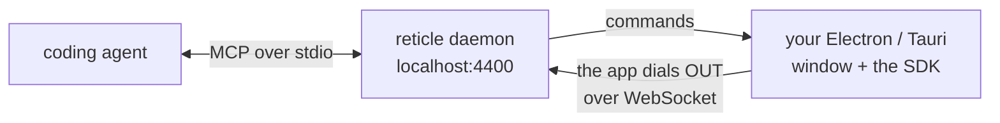

Reticle verifies Electron and Tauri apps the same way it verifies web apps: from **inside** the app, over a localhost WebSocket. There is no URL to open, no browser to launch, and no screenshot to interpret. Your app dials the daemon, and the agent drives it with the same tools it uses on the web.

This page is the complete desktop guide. Everything you need to wire, drive, and debug both runtimes is here.

## How you actually test a desktop app

The usual question is "it's a desktop app, so what URL does the agent open?". There isn't one, and that is the whole problem. The direction is reversed from what browser tooling trains you to expect:



Your app **connects to the daemon**, not the other way round. So the workflow is:

1. **Start the daemon once.**

   ```bash
   npx @reticlehq/server serve
   ```

2. **Start your app exactly as you always do.**

   ```bash
   npm run dev        # or: electron .   |   cargo tauri dev
   ```

3. **Confirm it connected.**

   ```bash
   npx @reticlehq/server status
   ```

   Your window appears as a session, and the agent can drive it.

`reticle open` has nothing to open for a desktop app and will say so, and there is no `reticle drive` for desktop: those launch a browser, which is not what you are testing. Headless works on both runtimes, covered below.

## The thing nobody else does

A desktop app's most interesting failures happen at the **IPC boundary**. The renderer asks the main process for something, and the main process quietly fails.

The renderer cannot see that. A screenshot certainly cannot. Reticle records it as a request:

```json
{ "method": "ipc", "url": "ipc://todos:archive", "status": 500, "ms": 82 }
```

Then it contradicts a UI that moved on regardless:

```json
{
  "kind": "signal-contradicted",
  "claim": "the app fired \"todos:loaded\"",
  "counter": "1 request(s) in the same window failed",
  "detail": "IPC ipc://todos:archive → 500"
}
```

The app said it loaded. One IPC call in the same window returned 500. Reticle puts both in front of the agent instead of believing the happier one.


<Note>
  The window on the left is an illustration. The JSON on the right is real output from the desktop
  battery, which starts a real Electron main process and a **packaged** Tauri binary and drives them
  headless on every change.
</Note>

## What works, measured

Every tool below was run against both demo apps against a live daemon.

The rows in **bold** are re-proven by a committed battery on every change, `pnpm test:e2e:desktop`, which starts a real Electron main process and a **packaged** Tauri binary (`tauri://localhost`, not `tauri dev`) and drives them headless. The rest were measured by hand. That distinction matters: this table used to report a hand-run score with nothing in the repo that reproduced it, so it could go stale without anything failing.

| Capability | Electron | Tauri | Note |
| --- | --- | --- | --- |
| sessions, snapshot, query, inspect | yes | yes | `inspect` returns `src/App.tsx:104` in a dev build; a packaged production renderer has no source map, so it reports `n/a` |
| capabilities, state (live store) | yes | yes | `reticle_state` reads the real store |
| act (click/fill/type/select) | yes | yes |  |
| **act_and_wait, wait_for, assert** | yes | yes | signal / state / route / net / console predicates |
| console errors | yes | yes | catches what the UI never shows |
| network (HTTP) | yes | yes | on `file://` a relative URL has no origin; use an absolute one |
| **network (IPC)** | yes | yes | `ipc://<channel>`, including failures. Electron: `invoke` and `sendSync` carry a verdict; a one-way `send` is recorded as `oneWay: true` with NO status, because the renderer never learns the outcome. Tauri: both the `ipc://` (macOS/Linux) and `http://ipc.localhost` (Windows) transports |
| route | yes | yes | use a **hash** router, see below |
| storage, animations, observe, explore | yes | yes |  |
| baseline (semantic), record then replay, crawl | yes | yes | `crawl` found real anomalies in both |
| navigate (reload) | yes | yes |  |
| **screenshot / visual_diff** | yes | yes | one line in Electron's main process, one Rust command in Tauri, both below. Reticle's own presenter panel is hidden for the shot, so a baseline records your app and not the instrument |
| **drivable while window occluded** | yes | yes | including minimized, app-hidden, and behind a fullscreen app on another Space |
| **headless** | yes | yes | Electron never shows the window; Tauri shows, loads, then hides |
| **a missing preload is DECLARED, not silent** | yes | n/a | without `@reticlehq/electron/preload` every IPC call is invisible, so verdicts carry `coverage: partial` naming the missing line instead of reading clean |
| network_mock, viewport | no | no | need a Reticle-driven browser |

## Three things that are genuinely different

<CardGroup cols={3}>
  <Card title="It works occluded" icon="eye-slash">
    Minimized, app-hidden, behind a fullscreen app on another Space. The agent keeps driving.
  </Card>
  <Card title="Screenshots cannot lie" icon="camera">
    Captured from the window's own backing store, never the screen.
  </Card>
  <Card title="Missing wiring is declared" icon="triangle-exclamation">
    Electron without the preload reports `coverage: partial`, not a clean pass.
  </Card>
</CardGroup>

## Electron setup

Two steps. The first is the ordinary web setup; the second is the only desktop-specific part.

**1. The renderer.** One line in `vite.config.ts`, exactly like a web app:

```ts
import { reticle } from '@reticlehq/vite-plugin';

export default defineConfig({
  base: './', // file:// needs relative asset paths
  plugins: [react(), reticle({ desktop: true })],
});
```

`desktop: true` does the two things a desktop shell needs and a web app must never get: the plugin also runs for `vite build` (a packaged renderer is a production build with **no dev server**, so the default serve-only gating would ship an app with no `connect()` at all), and `connect()` is called with `allowInProduction` so the SDK's production backstop does not refuse to start. Keep it behind your own dev-only build so an instrumented bundle can never reach a release binary.

Nothing to add in your app code. You can still call `reticle.connect()` by hand and pass `inject: false` if you want control.

**2. The preload.** One line, before you expose anything:

```bash
npm i -D @reticlehq/electron
```

```js
// electron/preload.cjs
require('@reticlehq/electron/preload');

const { contextBridge, ipcRenderer } = require('electron');
contextBridge.exposeInMainWorld('api', {
  loadTodos: () => ipcRenderer.invoke('todos:load'),
});
```

That line is what makes your main-process calls visible. It has to live in the preload, and it is not a stylistic choice: `contextBridge.exposeInMainWorld` hands the renderer a **deeply frozen, non-configurable** object, so nothing running in the page can instrument `window.api`. The preload is the last point where `ipcRenderer.invoke` is still an ordinary, writable function. Patching there covers every channel you go on to expose, whatever you named it.

**Preload sandboxing.** A sandboxed preload cannot resolve `node_modules`, so the bare `require` above fails with `module not found: @reticlehq/electron/preload`. Either bundle your preload (electron-vite and Electron Forge do this by default; the require is inlined at build time and sandboxing stays on), or set `sandbox: false` in `webPreferences`.

**Packaged renderers.** An app that loads its renderer with `loadFile` runs on `file://`, which is a production Vite build. Pass `allowInProduction: true` to `connect()` for that mode, or keep the SDK gated behind `import.meta.env.DEV` so it never enters the shipped binary at all.

Working example: [`apps/electron-smoke`](https://github.com/reticlehq/reticle/tree/main/apps/electron-smoke).

## Tauri setup

Frontend side, nothing desktop-specific:

```ts
// src/main.tsx
import { reticle } from '@reticlehq/browser';

if (import.meta.env.DEV) reticle.connect();
```

Nothing else is needed for IPC. A Tauri `invoke` travels as a real `fetch` to Tauri's `ipc://` custom protocol, so Reticle already sees it; every `invoke('load_todos')` shows up as `ipc://load_todos`. Reticle also reads Tauri's `Tauri-Response` header, because the transport answers **HTTP 200 whether the Rust command returned `Ok` or `Err`**. Without that translation a failed command would be recorded as a successful request.

The one required step is **CSP**. Tauri ships a restrictive default that blocks the bridge WebSocket before it opens, and the failure is silent from the app's side. In `src-tauri/tauri.conf.json`:

```json
{
  "app": {
    "security": {
      "csp": "default-src 'self' ipc: http://ipc.localhost; connect-src 'self' ipc: http://ipc.localhost ws://localhost:4400 ws://127.0.0.1:4400"
    }
  }
}
```

<Warning>
  Tauri's default CSP blocks the bridge WebSocket **before it opens**. Your app runs perfectly and
  simply never connects, with no error to go on. Keep `ipc: http://ipc.localhost` in `connect-src`,
  because Tauri v2 needs it for `invoke` itself. Add your dev-server origin too if you use `devUrl`.
  This is a dev-only config, so drop the `ws://` entries from your release config.
</Warning>

Working example: [`apps/tauri-smoke`](https://github.com/reticlehq/reticle/tree/main/apps/tauri-smoke).

## Screenshots

**Electron: one line in the main process.**

```js
const { installReticleCapture } = require('@reticlehq/electron/main');

const win = new BrowserWindow({/* ... */});
installReticleCapture(win);
```

That is all: no CDP flag, no extra packages, and it works on a packaged `file://` renderer. `reticle_screenshot` and `reticle_visual_diff` then work on your app.

Alternatively, since an Electron renderer _is_ Chromium, `--remote-debugging-port=9222` plus `RETICLE_CDP_URL=http://127.0.0.1:9222` also works and additionally enables `fullPage` (the main-process route captures the window as composited, so it cannot scroll-stitch).

**Tauri: one Rust command.** The crate is versioned independently of the npm packages:

```toml
[dependencies]
reticle-tauri = "2.13"
```

```rust
tauri::Builder::default()
    .invoke_handler(tauri::generate_handler![reticle_tauri::reticle_capture])
    .on_page_load(reticle_tauri::on_page_load)
```

Nothing on the JavaScript side: the SDK invokes the command through Tauri's own internals, because Tauri has no preload stage where a shim could be installed.

### Why the backing store, and not a screen capture

`webContents.capturePage()` reads the window's own backing store. Capturing a screen _region_ instead was tried and deliberately rejected: it photographs whatever is on top, so an app window behind your editor yields a picture of the editor, saved as a visual baseline that a later diff would trust. A screenshot tool that can silently return another window's pixels manufactures exactly the false green Reticle exists to eliminate.

`reticle_capture` on Tauri renders the webview for the same reason, so it needs no screen-recording permission, cannot return another window's pixels, and is correct with nothing on screen at all. Each platform uses its own webview API:

| Platform | API | Status |
| --- | --- | --- |
| macOS | `WKWebView.takeSnapshot` | Verified against a running app |
| Linux, BSD | WebKitGTK `webkit_web_view_get_snapshot` | Snapshot plus PNG encoding verified under `xvfb`, not yet driven through a full Tauri app |
| Windows | WebView2 `CapturePreview` | **Untested: compiles, never executed** |

The Windows path is written and type-checked against the real `webview2-com` API (which caught two genuine type errors), but nobody has run it on Windows. CI re-checks it against that target on every PR (`cargo check --target x86_64-pc-windows-msvc`), so "compiles" is a gate rather than a claim. Executed is still a different word from compiled: it is shipped rather than withheld so it can be tried, and labelled rather than listed flatly so that trying it is a choice. If it works for you, say so and this row changes; treat a green from it as unconfirmed until then.

All three capture the visible viewport by default, so a baseline taken on a developer's Mac is comparable against the same app in Linux CI. On a platform with no webview API to call, capture reports no-provider rather than returning a plausible wrong image.

**`{ fullPage: true }` works on Tauri/Linux only.** WebKitGTK can render the whole document offscreen; `takeSnapshot` (macOS) and `CapturePreview` (Windows) only give what is composited, and Electron's `capturePage()` is the same. Asked for a full page they cannot produce, all of them return `{ ok: false, reason: 'full-page-unsupported' }` rather than quietly handing back the viewport, which would be a baseline that omits everything below the fold while every later diff of it reports green about a region that was never captured. No baseline is written on a refusal.

An app that already has its own capture can expose `window.__reticleIpc.capture()` returning a PNG path instead; the SDK prefers it over the built-in command.

<Warning>
  One honest caveat. A fully occluded or minimized window is only partially composited, so parts of
  a capture may come back blank. Bring the window forward for a complete image. It is never the
  wrong window.
</Warning>

## Headless

**Electron: yes.** `show: false` plus `backgroundThrottling: false` in `webPreferences`. The second one is load-bearing: Chromium runs an unshown window's timers in slow motion, which turns every settle wait into a flake. Screenshots still work, because `capturePage` reads the backing store rather than the screen. Verified with a full tool drive against a window that was never shown.

**Tauri: yes. Show, load, then hide.**

```rust
.on_page_load(reticle_tauri::on_page_load)   // hides the window when RETICLE_HEADLESS=1
```

Run with `RETICLE_HEADLESS=1 pnpm tauri dev`. Nothing ends up on screen, and screenshots keep working because the capture renders the webview rather than the screen.

The ordering is the whole trick. Hiding the window during `setup` hides it before the webview has ever been presented, and a webview that has never been presented never loads its page, which is what made headless Tauri look impossible. Hiding it after its first page load leaves everything running. Verified with a full 43-tool drive plus a screenshot and a visual diff against a window that is not on screen.

`xvfb-run -a pnpm tauri dev` also works on Linux and needs no app-side change at all.

### A correction worth recording: the Tauri macOS "liveness constraint" was wrong

Earlier versions of this document said a Tauri app on macOS is only drivable while its window is on the active Space and unoccluded, and that hiding it suspends the webview. **That is not true, and the mistake is worth recording because it cost three features.**

Re-measured against the live app, a loaded Tauri webview answers Reticle commands at full speed while minimized, app-hidden with Cmd-H, fully occluded, on another Space behind a fullscreen app, and with no window on screen at all. A full 43-tool drive passes in every one of those states.

What actually failed was narrower: **a webview that has never been presented never loads its page.** Every "suspension" experiment hid or moved the window from `setup`, meaning before the first present, so the page never ran and every command timed out at 8s. The timeouts were real; the diagnosis was not. The `alwaysOnTop` workaround was then built to fix a problem that did not exist, measured as "still broken" for the same reason, and deleted.

The lesson generalises past this document: four experiments agreeing does not make a conclusion controlled, if all four share the same confound.

## Routing: use a hash router

A packaged renderer runs on `file://`, where `pushState('/settings')` rewrites the URL to `file:///settings`, a path that does not exist, so the next reload lands on a blank page and the app is gone. This is why HashRouter is the standard choice for packaged Electron and Tauri apps. Reticle's route observer handles both, and a `{ kind: 'route', contains: ... }` assertion matches the fragment.

## What IPC looks like to an agent

A desktop app reaches its backend over IPC, not HTTP. `fetch`/`XHR` patching cannot see that, so without the IPC observer every backend call in your app is a blind spot: `reticle_network` returns nothing, `act_and_wait` has no in-flight request to settle on, and `assert { net }` is vacuously true. That is a false green by construction.

Reticle records each IPC call as an ordinary request, so the tools you already use work unchanged:

```jsonc
// reticle_network { urlContains: "ipc://" }
{
  "calls": [
    { "method": "ipc", "url": "ipc://todos:load", "status": 200, "ms": 134 },
    { "method": "ipc", "url": "ipc://todos:archive", "status": 500, "ms": 83 },
  ],
}
```

IPC has no status code. `200`/`500` are synthetic, mapped from whether the call succeeded or failed, precisely so that `reticle_network { status: 500 }` and `assert { kind: "net", status: 500 }` keep working. On Tauri you will see `status: 500` next to `statusText: "OK"`. That is not a bug: the transport really did answer 200, and the 500 is the command's own verdict. `ok` is authoritative, and on Electron `error` carries the message your main process returned:

```jsonc
// reticle_assert { predicate: { kind: "net", urlContains: "ipc://todos:archive", status: 500 } }
{
  "pass": true,
  "evidence": {
    "url": "ipc://todos:archive",
    "ok": false,
    "status": 500,
    "error": "archive is not implemented in the backend",
  },
}
```

Both example apps ship a planted false green: an Archive button that updates the UI optimistically and swallows the rejection. The screen says "archived", a screenshot agrees, a DOM assertion agrees. Only the IPC record disagrees. That is the case desktop support exists for.

### Why a missing preload is not a silent pass

Without `@reticlehq/electron/preload`, every IPC call is invisible to Reticle. A tool that just reported clean there would be telling you the IPC layer is fine when it never looked. Instead verdicts carry `coverage: partial` and name the missing line.

## How it compares to Playwright MCP

Both attached to the same running Electron app, same task ("archive a todo, then verify it worked"):

| tool                    | ~tokens | ms      | verdict                                   |
| ----------------------- | ------- | ------- | ----------------------------------------- |
| reticle (lean)          | **350** | 1364    | caught the failure                        |
| playwright-mcp          | 1069    | **980** | blind to it: no network/IPC in its output |
| playwright-mcp to Tauri | n/a     | n/a     | cannot attach (no CDP in WKWebView)       |

Playwright MCP is faster. It is also structurally unable to see an IPC failure, because its channel is the accessibility tree.

## Troubleshooting

**`reticle status` shows no session.** Check the app's console. On Electron open devtools, or forward `console-message` to your terminal, since a desktop renderer has no visible console otherwise. A refused connect always logs why.

**Tauri: nothing connects and the app console shows a CSP violation.** The `connect-src` above is missing, or does not include your daemon's port. See [Tauri setup](#tauri-setup).

**Electron: `module not found: @reticlehq/electron/preload`.** The preload is sandboxed. Bundle it, or set `sandbox: false`. See [Electron setup](#electron-setup).

**IPC calls do not appear, but the app works.** On Electron the shim's `require` must run _before_ your preload captures its own reference to `ipcRenderer`, so put it on the first line. On Tauri, `invoke` imported from `@tauri-apps/api/core` is observed; a hand-rolled `postMessage` protocol is not, and neither is Tauri's `postMessage` transport fallback on platforms where the `ipc://` custom protocol is unavailable.

**`reticle open` says there is nothing to open.** That is correct for a desktop app. There is no URL, and there is no `reticle drive` for desktop either. Both launch a browser, which is not what you are testing.

**A screenshot came back partly blank.** The window is occluded or minimized, so it is only partially composited. Bring it forward and capture again.

**`{ ok: false, reason: 'full-page-unsupported' }`.** You asked for `fullPage: true` on a platform that cannot render offscreen. Only Tauri on Linux (WebKitGTK) can. Capture the viewport instead, or scroll and capture in sections.

## FAQ

<AccordionGroup>
  <Accordion title="Do I need a browser installed to verify a desktop app?">
    No. Reticle never launches Chromium for a desktop app. Your app connects to the local daemon,
    and the agent drives that connection.
  </Accordion>
  <Accordion title="Does my app have to be visible on screen?">
    No. A loaded window is drivable while minimized, app-hidden, occluded, or on another Space. The
    one requirement is that the window was presented at least once, because a webview that has never
    been presented never loads its page.
  </Accordion>
  <Accordion title="Can Playwright do this instead?">
    For Electron, partly: it attaches over CDP and sees the accessibility tree, but not IPC. For
    Tauri, no: WKWebView exposes no CDP endpoint, so Playwright cannot attach at all.
  </Accordion>
  <Accordion title="Does the SDK end up in my shipped binary?">
    Only if you put it there. Keep the plugin behind a dev-only build, or gate `connect()` on
    `import.meta.env.DEV`. `desktop: true` exists because a packaged renderer is a production build,
    so it opts that one build into instrumentation deliberately.
  </Accordion>
  <Accordion title="Why does a Tauri response show status 500 with statusText OK?">
    The IPC transport really did answer HTTP 200. The 500 is Reticle translating the Rust command's
    own `Err` result so that `status: 500` filters and assertions keep working. `ok` is
    authoritative.
  </Accordion>
</AccordionGroup>

<CardGroup cols={2}>
  <Card title="Electron package" icon="cube" href="/packages/electron">
    `@reticlehq/electron`: the preload shim and the main-process capture.
  </Card>
  <Card title="Tauri package" icon="cube" href="/packages/tauri">
    `reticle-tauri`: the Rust crate for capture and headless mode.
  </Card>
</CardGroup>
