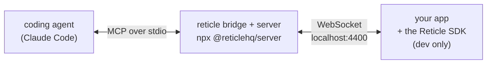

**To get started with Reticle: run `npx @reticlehq/server init --flow "<the journey worth proving>"` in your project root.** That one command wires your project, starts your dev server, opens the app, waits for it to connect, and drives that flow to a verdict. You do not restart anything and you do not drive it yourself. Reticle is a verification layer that embeds a dev-only SDK in your running web app so an AI coding agent can prove a change works instead of guessing. It needs Node 20 or newer, an app you run locally, and an agent that speaks MCP.

> **Looking for the fast path?** [Quickstart](/quickstart) gets you to a real verdict in five minutes, and every response on it was captured live. [Agentic install](/install-agentic) and [Manual install](/install-manual) cover setup in detail, per agent and per framework.
>
> This page is the long-form walkthrough: the same ground, more slowly, plus per-framework wiring, multi-app setups and prerelease notes. Start here if you want the whole picture in one file rather than the fast route.

This walks you from zero to your agent verifying your app, step by step, with real code for real frameworks. ~10 minutes.

- [What you're setting up](#what-youre-setting-up)
- [Prerequisites](#prerequisites)
- [Step 1: Connect your coding agent (MCP)](#step-1-connect-your-coding-agent-mcp)
- [Step 2: Embed the SDK in your app](#step-2-embed-the-sdk-in-your-app)
  - [Vite + React](#vite--react)
  - [Next.js](#nextjs)
  - [Plain / other frameworks](#plain--other-frameworks)
- [Step 3: (React) component and source-file mapping](#step-3-react-component-and-source-file-mapping)
- [Step 4: Run it and verify the connection](#step-4-run-it-and-verify-the-connection)
- [Step 5: Your first verification](#step-5-your-first-verification)
- [Step 6: Make your app agent-legible](#step-6-make-your-app-agent-legible-optional-high-leverage)
- [Common setups at a glance](#common-setups-at-a-glance)
- [Troubleshooting](#troubleshooting)

---

## What you're setting up

Three pieces, each tiny:



Three pieces, each from the package for its audience:

1. **The MCP server.** Your agent launches it with `npx @reticlehq/server mcp`; it hosts the tools _and_ the WebSocket bridge your app connects to. You don't run it by hand; the agent does.
2. **The SDK**: `import { reticle } from '@reticlehq/react'`, a few lines in your app's dev entry point.
3. **(Optional) React adapter + source-mapping**, so `reticle_inspect` can tell the agent which component/file to edit (also from `@reticlehq/react`).

Everything is **dev-only** and **localhost-only**. It's tree-shaken out of production builds.

## Prerequisites

- Node 20 or newer, and a package manager (npm/pnpm/yarn).
- A coding agent that speaks MCP: Claude Code, Cursor, Windsurf, Claude Desktop, etc.
- A web app you run locally in dev (any framework; React gets the richest features).

---

## Fastest path: `reticle init`

From your project root:

```bash
RETICLE_INSTALL_SOURCE=docs_site npx @reticlehq/server init
```

It detects your framework, package manager, and React version, then:

- **registers the Reticle MCP server once, globally, for each agent you have installed** (Claude Code via `claude mcp add reticle -s user`, and/or Cursor via `~/.cursor/mcp.json`), so every project on this machine gets it; you never re-add it per project,
- **writes a verification rule into your agent's instruction file** (`CLAUDE.md`, `.cursor/rules/reticle.mdc`, or `AGENTS.md`), so the agent knows to verify a feature with Reticle _after building it_, not only when you remember to ask (idempotent; appended below anything you already have),
- installs the SDK kit (`@reticlehq/react`) and the right build plugin (`@reticlehq/vite-plugin` or `@reticlehq/next`) as dev dependencies,
- **Vite:** adds the `reticle()` plugin to your config, which wires source mapping _and_ `reticle.connect()` for you, so there is nothing else to edit,
- **Next / other:** creates the dev component and prints the exact `withReticle` / mount / connect snippets to paste (it never half-edits a build config).

The bridge + MCP server is a single process that serves all your projects, so it's registered at **user scope**, not in a per-project `.mcp.json`. Only the SDK (the `reticle()` plugin / connect call) is added per project.

Re-running is safe: already-registered and already-patched steps are skipped, and on a wired project it goes straight to proving the app still works. Preview without writing via `npx @reticlehq/server init --dry-run`.

`init` does not stop at writing files. It starts your dev server (restarting one whose bundle predates the config edit), opens the app, waits for a session to connect from inside it, and drives one flow to a verdict, which it saves so later checks are a single call with no model involved. It exits non-zero if no verdict was produced and prints what is left to do.

Three flags carry what the command cannot work out for itself:

| Flag | What only you know |
| --- | --- |
| `--flow "<what>"` | Which journey proves the thing you care about. It can list the buttons on your page; it cannot know that checkout matters and the theme toggle does not. |
| `--env KEY=VALUE` | What your app needs to reach a usable state: the key from `.env.example`, the mock backend, the variable that skips an auth wall. Repeatable. |
| `--app <dir>` | Which app in a monorepo. It finds the servable ones; only you know which you are working in. |

The rest are dials: `--license <key>` (writes it to `.env` and keeps `.env` out of git), `--json` (one object for an agent to read), `--files-only` (write, register, pre-approve, and stop, which is what `init` did before it learned to boot the app, and what an existing install re-runs to pick up new wiring), `--no-open`, `--no-drive`, `--dry-run`, `--port N`, `--no-mcp`, `--no-install`.

Then restart your dev server and skip to [Step 4](#step-4-run-it-and-verify-the-connection). The manual steps below explain what `init` sets up, if you prefer to wire it yourself.

---

## Step 1: Connect your coding agent (MCP), once

You don't start the server manually; your agent starts it via MCP. Register Reticle **once, at the user (global) scope** so every project picks it up. There's nothing to add per project.

**Claude Code**, one command:

```bash
claude mcp add reticle -s user -- npx @reticlehq/server mcp
```

(`reticle init` runs exactly this for you. `-s user` is what makes it global; drop it for a project-local registration instead.)

**Cursor**: add to your global `~/.cursor/mcp.json` (not per-project; `reticle init` writes this for you):

```jsonc
{
  "mcpServers": {
    "reticle": { "command": "npx", "args": ["@reticlehq/server", "mcp"] },
  },
}
```

Other MCP clients (Windsurf, Claude Desktop, …) use the same `command`/`args` shape. Restart the agent so it picks up the new server. When it launches Reticle, the bridge starts listening on `ws://localhost:4400`.

> Want a different port? Set `RETICLE_PORT` in the server `env` and pass the same URL to `reticle.connect({ url })` in Step 2.

---

## Step 2: Embed the SDK in your app

Install the SDK kit plus your framework's build plugin as dev dependencies (the kit re-exports the browser sensor, so one install gives both `reticle` and `install`):

```bash
npm i -D @reticlehq/react @reticlehq/vite-plugin     # Vite; or: pnpm add -D …
# Next.js instead? npm i -D @reticlehq/react @reticlehq/next
```

Then call `reticle.connect()` once, in dev only. Where you put it depends on your framework.

### Vite + React

**Recommended: the Vite plugin (one line, does everything).** Add `reticle()` to your `vite.config.ts`:

```ts
import { defineConfig } from 'vite';
import react from '@vitejs/plugin-react';
import { reticle } from '@reticlehq/vite-plugin';

export default defineConfig({
  plugins: [reticle(), react()],
});
```

This injects `reticle.connect()` for you _and_ handles React 19 source mapping (Step 3), so there's no entry-file edit and no separate Babel setup. `apply: 'serve'` means it's dropped from `vite build` entirely, so it can never reach production. (This is exactly what `reticle init` adds.)

<details>
<summary>Prefer to wire it by hand instead of the plugin?</summary>

In your entry file (`src/main.tsx`), call `connect()` in dev only:

```tsx
import { StrictMode } from 'react';
import { createRoot } from 'react-dom/client';
import { reticle, SESSION_AUTO } from '@reticlehq/react';
import { App } from './App';

if (import.meta.env.DEV) {
  // SESSION_AUTO gives this tab a unique session id, so multiple apps/tabs never collide.
  reticle.connect({ session: SESSION_AUTO }); // connects to ws://localhost:4400 by default
}

createRoot(document.getElementById('root')!).render(
  <StrictMode>
    <App />
  </StrictMode>,
);
```

On React 19 you then also need the source-mapping Babel plugin from Step 3. The Vite plugin above bundles both, which is why it's the recommended path.

</details>

### The pairing token (why some setups need one line more)

The daemon auto-generates a **pairing token** on first run and stores it at `~/.reticle/pairing-token` (owner-only, `0600`). The bridge requires it, so another app running on `http://localhost:<some-other-port>` can't quietly register or drive your session. Only code that can read that file (your dev server, not a web page) can present it.

- **Vite plugin users:** nothing to do. The plugin reads the token server-side and injects it into `connect()` for you.
- **Next.js / hand-wired `connect()`:** your `connect()` runs in the browser and can't read the file, so pass the token in yourself. The simplest path is a shared secret: set `RETICLE_TOKEN` for the daemon (it uses that instead of auto-generating) and expose the same value to the client as `NEXT_PUBLIC_RETICLE_TOKEN`, then pass it to `connect({ token })` (see below). On a single-user machine you can also just read `~/.reticle/pairing-token` in your dev tooling and forward it the same way.

### Next.js

Create a tiny client component and mount it in your root layout, dev-only:

```tsx
// app/reticle-dev.tsx
'use client';
import { useEffect } from 'react';

export function ReticleDev() {
  useEffect(() => {
    if (process.env.NODE_ENV === 'development') {
      // SESSION_AUTO = a unique id per tab, so several Next apps/tabs never collide on one session.
      // NEXT_PUBLIC_RETICLE_TOKEN carries the pairing token to the browser (see "The pairing token").
      const token = process.env.NEXT_PUBLIC_RETICLE_TOKEN;
      void import('@reticlehq/react').then(({ reticle, SESSION_AUTO }) =>
        reticle.connect({ session: SESSION_AUTO, ...(token ? { token } : {}) }),
      );
    }
  }, []);
  return null;
}
```

```tsx
// app/layout.tsx
import { ReticleDev } from './reticle-dev';

export default function RootLayout({ children }: { children: React.ReactNode }) {
  return (
    <html lang="en">
      <body>
        {process.env.NODE_ENV === 'development' && <ReticleDev />}
        {children}
      </body>
    </html>
  );
}
```

### Plain / other frameworks

Anywhere your app boots in dev:

```ts
import { reticle, SESSION_AUTO } from '@reticlehq/react';
// Pass the pairing token (see "The pairing token" above); on a hand-wired setup you supply it yourself.
if (location.hostname === 'localhost')
  reticle.connect({ session: SESSION_AUTO, token: import.meta.env.VITE_RETICLE_TOKEN });
```

Or, with no build step, a script tag pointed at the bridge:

```html
<script type="module">
  import { reticle, SESSION_AUTO } from 'https://esm.sh/@reticlehq/react';
  reticle.connect({ session: SESSION_AUTO });
</script>
```

> **Want to watch the agent work?** Add `present: true` to `reticle.connect()` for a glowing border, a synthetic cursor that flies to targets, click/hover effects, and a narration HUD. See [usage §16](usage.md#16-presenter-mode-narration--fake-clock-watch--control).

### Running multiple apps at once

It's common to have several apps open in dev: a few Next.js and React projects, or multiple tabs of the same app. Reticle handles this cleanly **as long as each connection has a unique session id**, which is exactly what `SESSION_AUTO` gives you (a fresh id per tab). The examples above all use it, so you get this for free. When more than one app is connected, an Reticle tool call targets the focused / most recently active one automatically, or you can pass an explicit `sessionId` to target a specific app.

**Two separate projects, fully isolated.** If you want each repo to have its own independent Reticle bridge (separate sessions, separate `.reticle/` workspace), give each project its own port. Set the same port in both the MCP server config and the app's connection:

```jsonc
// project-b/.mcp.json: give this project its own bridge port
{
  "mcpServers": {
    "reticle": {
      "command": "npx",
      "args": ["-y", "@reticlehq/server", "mcp"],
      "env": { "RETICLE_PORT": "4401" },
    },
  },
}
```

```ts
// project-b's app: dial the same port
reticle.connect({ session: SESSION_AUTO, url: 'ws://localhost:4401/reticle' });
```

**On the Vite plugin?** You don't have a hand-written `connect()` to edit; the plugin injects it. Set the port on the plugin instead, and it bakes the matching URL in for you:

```ts
// project-b/vite.config.ts
plugins: [reticle({ port: 4401 }), react()],
```

Either way, the rule is the same: **the app's bridge port must equal the daemon's `RETICLE_PORT`**, and it's the Reticle bridge port, never your dev-server port. Project A stays on the default `4400`, project B on `4401`; they never touch each other. (A port that is already in use now fails fast with a clear error instead of hanging, so a misconfiguration is obvious.)

---

## Step 3: (React) component and source-file mapping

This is optional but high-value: it lets `reticle_inspect` map a DOM element back to the **React component and the source file:line**, so when the agent finds a problem, it knows which file to edit. (The React adapter ships in `@reticlehq/react`; nothing extra to install.)

```ts
import { install as installReticleReact } from '@reticlehq/react';
if (import.meta.env.DEV) installReticleReact(); // call before reticle.connect()
```

**React ≤ 18:** that's all; it uses React's dev `_debugSource`.

**React 19:** React removed `_debugSource`, so the source has to be stamped at build time. **If you added the `reticle()` Vite plugin in Step 2, this is already handled, so skip ahead.** Otherwise add the Babel plugin (`@reticlehq/babel-plugin`) to stamp the source onto elements in dev:

```ts
// vite.config.ts
import react from '@vitejs/plugin-react';
import reticleSource from '@reticlehq/babel-plugin';

export default defineConfig({
  plugins: [react({ babel: { plugins: [reticleSource] } })],
});
```

> **Next.js:** verified on **Next.js 15 / React 19 (app router, SWC)**. For source-file mapping, use `@reticlehq/next` instead of the Babel plugin. It adds a **dev-only webpack pre-loader that keeps SWC** and stamps `data-reticle-source` so `reticle_inspect` returns `file:line` (e.g. `app/page.tsx:30`):
>
> ```ts
> // next.config.ts
> import { withReticle } from '@reticlehq/next';
> import type { NextConfig } from 'next';
>
> const nextConfig: NextConfig = {};
> export default withReticle(nextConfig); // no-op in production
> ```
>
> This is exactly what `reticle init` writes. `@reticlehq/next` is CommonJS, so a default import (`import reticleNext from '@reticlehq/next'` then `reticleNext.withReticle(...)`) and a CJS `const { withReticle } = require('@reticlehq/next')` both work too, if your config is `.mjs` or `.js`.
>
> Component identity works with or without it (Next's internal wrappers are filtered out so you see your components, e.g. just `Page`).

---

## Step 4: Run it and verify the connection

> `reticle init` does this for you: it starts the dev server, opens the app and waits for the session. Read on only if you are wiring by hand, or if it told you it could not.

1. Start your app's dev server as usual (`npm run dev`).
2. Open it in the browser (the SDK connects when the page loads).
3. In your agent, ask it to confirm the connection:

> "List Reticle sessions."

The agent calls `reticle_sessions` and should see your tab:

```jsonc
{ "sessions": [{ "sessionId": "my-app", "url": "http://localhost:3000/", "title": "…" }] }
```

If the list is empty, see [Troubleshooting](#troubleshooting).

---

## Step 5: Your first verification

> `reticle init --flow "<what>"` drives this for you and saves the flow. This section is what it does, for when you want to do it yourself.

Now just talk to your agent in plain language. For example:

> "Add a 'Refresh' button to the header that re-fetches the dashboard data, then use Reticle to verify clicking it fires `GET /api/dashboard` and shows no console errors."

What the agent does under the hood:

```jsonc
// finds the button it just added
reticle_query({ by: "role", value: "button", name: "Refresh" })   // → ref e12

// clicks it
reticle_act({ ref: "e12", action: "click" })                       // → { since: 920 }

// verifies the reaction
reticle_assert({ timeout_ms: 2000, predicate: { kind: "allOf", predicates: [
  { kind: "net", method: "GET", urlContains: "/api/dashboard", status: 200, since: 920 },
  { kind: "console", level: "error", absent: true }
]}})
// → { pass: true }
```

You get a real, evidence-backed answer. If it fails, the agent sees the reason (e.g. the call 404'd, or a `TypeError` in `Dashboard.tsx:88`) and can fix it and re-check.

That's the whole loop. From here, the [Usage Guide](usage.md) covers every tool, the full predicate DSL, and a dozen real situations (login, long lists, eventual consistency, file uploads, LLM calls, regressions, and more).

---

## Step 6: Make your app agent-legible (optional, high-leverage)

The basics above work with zero app changes. These four additions make the agent dramatically faster and let it verify things the DOM can't express; they're what turn Reticle from "usable" into "magic." All are dev-only.

**1. Stable `data-testid` on key elements.** Agents target testids more reliably than visible text (which changes with copy/i18n). Reticle matches testids _exactly_.

```tsx
<button data-testid="refresh">Refresh</button>
```

**2. `reticle.signal` for off-DOM facts.** When something matters but isn't visible (a save committed, a webhook arrived, an edit applied, an LLM caption finished), emit a signal the agent can assert on. This is the single highest-value instrumentation.

```ts
import { reticle } from '@reticlehq/react';
onSaved(() => reticle.signal('order:saved', { id, total }));
// agent: reticle_assert({ predicate: { kind: 'signal', name: 'order:saved', dataMatches: { id: '*' } } })
```

> **Recommended:** instead of importing `reticle` into components, inject a `createReticleEmitter()` emitter and pair each commit with `commitAndSignal(...)` so the mutation↔signal can't drift. `reticle.signal` stays the primitive underneath. See [integration-patterns.md](integration-patterns.md).

**3. `registerStore` so the agent reads state directly.** No need to broadcast a signal for every fact: expose the store and the agent reads it via `reticle_state`.

```ts
import { registerStore } from '@reticlehq/react';
registerStore('cart', useCart); // pass the store itself → auto STATE_CHANGE diffs
// agent: reticle_state({ store: 'cart' })  → { stores: { cart: {...} } }
```

**4. `registerCapabilities` so a fresh agent learns the surface without reading source.**

```ts
import { registerCapabilities } from '@reticlehq/react';
registerCapabilities({
  testids: ['refresh', 'cart-open', 'checkout'],
  signals: ['order:saved', 'cart:updated'],
  stores: ['cart'],
});
// agent: reticle_capabilities()  → the whole testable surface
```

> **Multi-domain apps:** prefer `registerReticleDomain({ testids, signals, stores })` co-located in one `reticle.ts` per domain. Each self-registers and `reticle_capabilities()` assembles the union, so there's no central map to forget. See [integration-patterns.md](integration-patterns.md).

> Watch the agent work: pass `present: true` to `reticle.connect()` for a glowing border, a cursor that flies to targets, and a HUD; the agent can call `reticle_session {action:"narrate"}({ text })` to show its intent. See [usage §16](usage.md#16-presenter-mode-narration--fake-clock-watch--control).

> **Hover-gated UI (tooltips, hover menus, pointer drag)?** Synthetic events can't trigger native `onMouseEnter`. Enable **real input** by launching your browser with `--remote-debugging-port=9222` and setting `RETICLE_CDP_URL` in the MCP server `env`. Reticle then drives real pointer input and `reticle_act` reports `inputMode:"real"`. See [usage §18](usage.md#18-real-input-mode-native-hover--drag).

---

## Going further

Once the loop works, these turn ad-hoc runs into a maintained suite:

- **[Flows, recorder & self-healing](flows.md)**: record a golden path once; Reticle saves it to a git-checked `.reticle/` flow anchored on testid+signal, replays it (with legible drift), and `reticle_flow_heal` repairs renamed anchors.
- **[Testing with `@reticlehq/test`](testing.md)** gives you declarative `reticleTest` specs you run headless / in CI; flows can _become_ the specs.
- **[Human-in-the-loop control](human-control.md)**: with `present: true`, pause / message / end the agent from the floating panel.
- **[Integration patterns](integration-patterns.md)** covers the recommended zero-prod-bundle emit adapter, store-layer signals, and incremental adoption.

---

## Common setups at a glance

Everything below comes from the `@reticlehq/react` kit plus your framework's build plugin.

| Stack | SDK connect | Source mapping |
| --- | --- | --- |
| Vite + React (any) | `reticle()` plugin (auto), or `connect()` | `reticle()` plugin handles it (incl. React 19) |
| Next.js (app router) | `ReticleDev` client component in layout (dev) | `@reticlehq/next` (`withReticle`) → component + file:line |
| SvelteKit | `src/hooks.client.ts` (written by `reticle init`) | `reticle()` plugin stamps `.svelte` → file:line |
| Vanilla / plain HTML | `reticle.connect()` at boot (dev) | none (refs and testids only) |

### What Svelte support is, and what it is not

`reticle init` detects SvelteKit and writes both halves: a client hook that calls `connect()` (SvelteKit renders through `app.html`, so the plugin's HTML injection never fires) and `reticle()` in `vite.config`, which is what stamps `data-reticle-source`.

**You get** `file:line` on every element in a `.svelte` component, plus everything the framework-agnostic core already gave you (DOM, network, console, routing, storage, actions), and `svelteStore` for reading a Svelte store (see [usage](usage.md)).

**You do not get** component identity. `@reticlehq/react` walks the fiber tree to answer "which component rendered this element"; there is no Svelte equivalent, so snapshots carry the file and line but no component name. Stamping targets Svelte 5's compiler AST and also accepts Svelte 4's; `.svelte.ts` runes modules are code rather than markup and are not stamped.

**It is still unverified.** There is no SvelteKit app in `apps/` and no CI gate for one, so nothing would tell us when this breaks; `reticle init` says so out loud in its plan. React, Next.js, Remix and Astro each have an app and a gate. Treat SvelteKit as wired and plausible, not as supported.

**Vue is install-gated, drive-unverified.** `init` detects a Vue app (as a Vite app with Vue as the UI library) and the install gate scaffolds one from scratch, runs `init`, boots it and waits for a session, so the setup is proven. What is not proven is the drive: there is no Vue example app in CI. `piniaStore` reads a Pinia store, and everything the framework-neutral core provides works. What you do not get is a `source` field, because source stamping covers JSX and Svelte components and a `.vue` single-file component is neither. See [Frameworks](/frameworks) for the full status table.

---

## Troubleshooting

**`reticle_sessions` is empty / "no browser session connected"**

- Run **`reticle status`**. It shows whether the daemon is up and which tabs are connected (url, health, pending flagged bugs) at a glance. No connected sessions means the SDK isn't reaching the bridge.
- Is your app actually running and open in a browser tab?
- Is `reticle.connect()` running? (Check it's inside your dev guard and the guard is true.)
- Port mismatch? If you set `RETICLE_PORT`, pass the same URL to `reticle.connect({ url: 'ws://localhost:<port>/reticle' })`.
- Need to restart the daemon? **`reticle stop`** cleans it up, no `pkill` needed.

The errors Reticle returns to the agent now carry a `recovery` hint for this exact situation (and for multiple/unknown sessions, a throttled tab, a missing baseline), so the agent knows the next move.

**The agent can't find an element**

- Ask it to `reticle_snapshot({ mode: "interactive" })` to see what's actionable.
- Add a `data-testid` to the element for a stable handle.
- Narrow with `scope` (a CSS selector or a ref).

**Assertions are flaky on async UIs**

- Use `timeout_ms` on `reticle_assert` / `reticle_wait_for`.
- Pass the `since` cursor returned by `reticle_act` so only post-action events count.

**Source file isn't resolving on React 19**

- Wire up `@reticlehq/babel-plugin` (Step 3). Without it, only component identity is available.

**Nothing should run in production**

- Keep `reticle.connect()` behind a dev guard (`import.meta.env.DEV` / `NODE_ENV`). The package is side-effect free and tree-shakes out when unused. As a backstop, `connect()` also self-disables when the build reports `NODE_ENV=production` (so an SSR healthcheck or a prod bundle opened on localhost won't activate it). Pass `allowInProduction: true` only for a deliberate prod diagnostic.

## Installing alongside a Next.js or React prerelease

`@reticlehq/next` declares `peer next >=13`, and `@reticlehq/react` declares `peer react >=18`. If your app runs a **prerelease**, such as a Next.js canary/preview (`16.3.0-preview.9`) or a React RC, npm will refuse the install with `ERESOLVE`.

That is npm's semver rule, not a Reticle restriction: a prerelease version satisfies a range only when some comparator shares its exact `major.minor.patch`. No floor-style range accepts it (verified, including `*`). Marking the peer optional does not help either, because npm still version-checks a peer that is present.

Install with either of these instead. Both are safe; the floor is a real minimum, not a maximum:

```bash
npm install @reticlehq/next --legacy-peer-deps
# or use pnpm, whose peer resolution does not hard-fail here
pnpm add @reticlehq/next
```

---

## Frequently asked questions

### What exactly does `reticle init` change in my project?

Four files, and none of them are mysterious: a `.reticle.json` project config, your build config (the `reticle()` Vite plugin, or `withReticle` in `next.config`), a dev-only capabilities file at `src/reticle-dev.ts` (or `app/reticle-dev.tsx` on Next.js), and your agent's rule files. It then starts your dev server, opens the app and drives one flow, none of which changes your source: the dev server is left running for you afterwards, and the only file the drive may edit is the capabilities file, and only when your app registers none. It also registers the MCP server globally, which is a once-per-machine step rather than a per-project one. Run `npx @reticlehq/server init --dry-run` first to see the exact plan before anything is written.

### Do I have to re-register the MCP server for every project?

No. The bridge and MCP server are a single process serving all your projects, so `init` registers it at user scope. Every later project starts with the tools already there. Only the SDK wiring is per project.

### Why do the Reticle tools not appear after installing?

Because your agent read its MCP server list at startup, before Reticle existed, and no slash command re-reads it. Restart the agent process: quit and reopen Claude Code, reload the window in Cursor, or press Start in `.vscode/mcp.json` in VS Code. `/mcp` only manages servers that are already loaded, so it cannot discover a new one.

### Which Node version do I need?

Node 20 or newer.

### Do I need the React adapter?

No, it is optional enrichment and the core works without it. What it adds is component identity, meaning `reticle_inspect` can say which React component rendered an element. Combined with a build plugin that stamps source, that is what turns a DOM node into `src/components/Login.tsx:81`, which is the difference between an agent knowing something failed and knowing which file to open.

### Can I run several apps against Reticle at once?

Yes, as long as each connection has a unique session id, which `SESSION_AUTO` gives you automatically. Tool calls target the focused or most recently active app, or you can pass an explicit `sessionId`. If you want two projects fully isolated, give each its own bridge port and set the same port in both the MCP server config and the app's connection.

### Will Reticle end up in my production bundle?

No. Keep `connect()` behind a dev guard (`import.meta.env.DEV` or a `NODE_ENV` check); the packages are side-effect free and tree-shake out when unused. The Vite plugin uses `apply: 'serve'`, so it is dropped from `vite build` entirely. As a backstop, `connect()` also self-disables when the build reports `NODE_ENV=production`.

### Why is my install failing with `ERESOLVE`?

You are almost certainly on a Next.js canary or a React RC. That is npm's semver rule for prereleases, not a Reticle restriction. Install with `--legacy-peer-deps`, or use pnpm, whose peer resolution does not hard-fail here. See [Installing alongside a Next.js or React prerelease](#installing-alongside-a-nextjs-or-react-prerelease) above.
